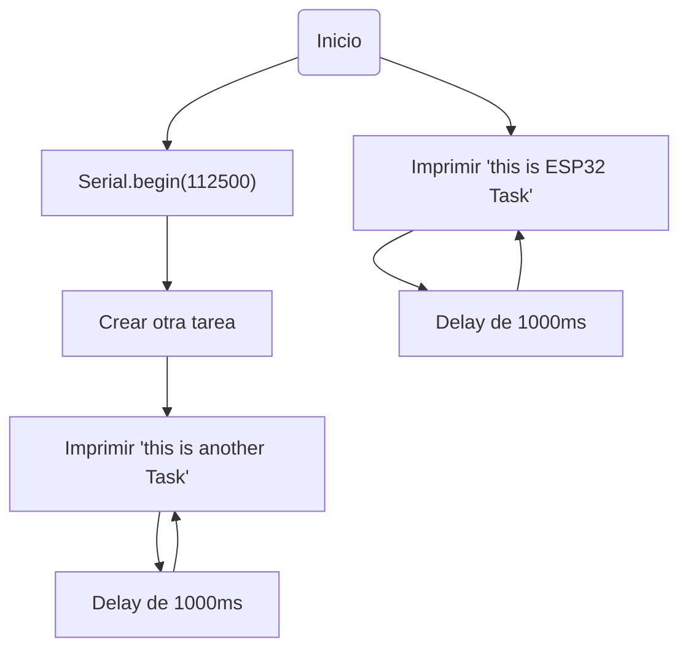

# Práctica 4: SISTEMAS OPERATIVOS EN TIEMPO REAL
## Introducción de la práctica
En esta práctica va enfocada en los sistemas operativos en tiempo real, especialmente la ejecución de tareas, dónde se dividirán entre ellas el tiempo de uso para realizarlas.

## Primera parte del ejercicio práctico
```c++
#include<Arduino.h>

void anotherTask(void *parameter);

void setup() {
  Serial.begin(112500);

  xTaskCreate(
      anotherTask,     
      "another Task",  
      10000,           
      NULL,             
      1,               
      NULL              
  );
}

void loop() {
  Serial.println("this is ESP32 Task");
  delay(1000);
}

void anotherTask(void *parameter) {
  
  for (;;) {
    Serial.println("this is another Task");
    delay(1000);
  }

  vTaskDelete(NULL);
}
```
### Funcionamiento y salida por terminal
El funcionamiento de el código proporcionado, se basa en que crea 2 tareas donde se utliza un un sistema de operativo de tiempo real FreeRTOS.

- **La tarea principal**: se ejecuta en la función *loop()*, imprime repetidamente un mensaje ("this is ESP32 Task") en el puerto serie y espera 1 segundo entre cada impresión.
- **La segunda tarea**: creada en la función *setup()* y llamada anotherTask, también imprime repetidamente un mensaje ("this is another Task") en el puerto serie y espera 1 segundo entre cada impresión.

Las salidas que se muestran ppor el puerto serie son las siguientes:
```
   - this is ESP32 Task
   - this is another Task
```
Adjunto diagrama de flujo del funcionamiento:


## Segunda parte del ejercicio práctico - Semáforo
```c++
#include <Arduino.h>
#include <FreeRTOS.h>
#include <task.h>
#include <semphr.h>

const int ledPin = 11;

SemaphoreHandle_t semaphore;

void setup() {
    Serial.begin(115200);
    pinMode(ledPin, OUTPUT);

    semaphore = xSemaphoreCreateBinary();
    
    xTaskCreate(encenderLED, "Encender LED", 1000, NULL, 1, NULL);
    xTaskCreate(apagarLED, "Apagar LED", 1000, NULL, 1, NULL);
}

void loop() {

}

void encenderLED(void *parameter) {
    for (;;) {
        digitalWrite(ledPin, HIGH);
        Serial.println("LED HIGH");
        delay(1000);
        xSemaphoreGive(semaphore); 
    }
}

void apagarLED(void *parameter) {
    for (;;) {
        digitalWrite(ledPin, LOW);
        Serial.println("LED LOW");
        delay(1000);
        xSemaphoreGive(semaphore); 
    } 
```
### Funcionamiento y salida por terminal

En el anterior código tenemos un programa donde con la ayuda de un semáforo, se pueden utilizar dos tareas, (una que enciende el led ) y otra tarea ( que apaga el Led), en el programa se puede ver que el tiempo del DELAY es de 1 segundo, lo cual cada 1 segundo se van alternando.

### Funciones / Subprogramas utilizados: 

En este codigo tenemos 4 funciones para llevarlo a cabo.

 - #### *Función setup()* :
   se inicia la comunicación serial y se configura el pin del LED como salida.

 - #### *Función loop()*:
   no es necesario realizar ninguna acción en el bucle principal.

 - #### *Funciones : encenderLED() y apagarLED()*:
   son las tareas que se ejecutarán concurrentemente. Ambas funciones son ciclos infinitos (for (;;)) que alternan entre encender y apagar el LED con un intervalo de un segundo.

### Salida puerto serie:

Alternando las 2 tareas, se imprime "LED HIGH" cuando el LED se enciende, y en la función apagarLED(), se imprime "LED LOW" cuando el LED se apaga. 

```
LED HIGH
LED LOW
LED HIGH
```
   
   
